## Demo Video
- Click will take you to youtube
[](https://youtu.be/lYOiwAHL3XE)

# Local AI Architecture

A fully local, offline, multimodal AI system designed with a biomimetic architecture that mimics the human brain's structure by separating functionalities into specific "cortices" (processes) that communicate via a central nervous system.

## Overview

This project implements a brain-inspired AI system that bypasses Python's Global Interpreter Lock (GIL) through heavy use of multiprocessing, allowing multiple heavy AI models (Vision, LLM, TTS, STT) to run simultaneously without freezing the UI.

## High-Level Architecture

The system is orchestrated by `cerebrum.py`, which distributes heavy computational tasks across independent processes. This ensures that resource-intensive operations like visual processing (YOLO/Moondream) or LLM generation (Qwen) do not block real-time responsiveness of audio wake-word detection or the web UI.

## Component Map

| Component | File | Biological Analogy | Function |
|-----------|------|-------------------|----------|
| Cerebrum | `cerebrum.py` | Central Nervous System | Orchestrates processes, manages shared memory (mp.Manager), handles startup/shutdown |
| Optic Nerve | `visualcortex.py` | Eyes | Captures raw video frames via OpenCV |
| Visual Cortex | `visualcortex.py` | Occipital Lobe | Processes images using YOLO (fast detection) and Moondream (deep understanding/VLM) |
| Auditory Nerve | `audiocortex.py` | Ears (Cochlea) | Captures raw audio streams via SoundDevice |
| Auditory Cortex | `audiocortex.py` | Temporal Lobe (Audio) | Voice Activity Detection (Silero), Speech-to-Text, Speaker Recognition |
| Broca's Area | `brocasArea.py` | Speech Center | Text-to-Speech synthesis and audio playback (Kokoro) |
| Temporal Lobe | `temporallobe.py` | Sensory Integration | Aggregates data from Audio and Visual cortices into unified state |
| Prefrontal Cortex | `prefrontalcortex.py` | Frontal Lobe (Logic) | LLM (Qwen) for decisions, tool use (Internet), conversational logic |
| Server | `server.py` | Conscious Interface | Flask web server for visualizing what the system sees, hears, and thinks |

## Data Flow & Multiprocessing Strategy

The system relies on `multiprocessing.Queue` for data transport and `multiprocessing.Dict` for shared state between isolated processes.

### 1. Visual Pathway (visualcortex.py)

- **Capture**: `optic_nerve_connection` captures video frames
- **Queue**: Pushes to `internal_nerve_queue` (LIFO - drops old frames to reduce latency)
- ***optic nerve queue data schema*** 
```python
{
                'camera_index': camera_index,
                'frame': frame,
                'capture_timestamp': timestamp
            }
```
- **Core Processing**: `visual_cortex_core` consumes frames
  - Runs YOLOv8 for person detection
  - If enabled, copies frame to `internal_to_vlm_queue` for VLM worker
- **Output**: Processed data (bounding boxes, captions) pushed to `external_cortex_queue`
- ***visual cortex queue data schema***
```python
{
                            'capture_timestamp':capture_timestamp,
                            'person_detected':person_detected,
                            'person_match': False,
                            'person_match_probability': 0.0,
                            'camera_index': device_index,
                            'caption': "",
                            'query': "",
                            'obj_detect': [],
                            'points': [],
                            'vlm_timestamp': capture_timestamp,
                            'formatted_time': datetime.fromtimestamp(capture_timestamp).strftime('%H:%M:%S')
                        }
```

### 2. Auditory Pathway (audiocortex.py)

- **Capture**: `auditory_nerve_connection` captures raw audio chunks
- ***auditory nerve queue data schema***
```python
{
            'device_index': device_index,
            'audio_frame': indata.copy().flatten().astype(np.float32),  # Already float32, optimal for VAD
            'capture_timestamp': timestamp,
            'sample_rate': sample_rate
        }
```
- **VAD**: `auditory_cortex_core` analyzes chunks, accumulates buffer when speech detected
- **Transcription**: When silence detected, buffer moves to `nerve_from_cortex_to_stt`
- **Recognition**: Audio simultaneously sent to `nerve_from_stt_to_vr` to identify speaker
- **Output**: Final transcript and Speaker ID pushed to `external_cortex_queue`
- ***audio cortex queue data schema*** 
```python
{
                        'transcription': "",
                        'final_transcript': False,
                        'voice_id': None,
                        'voice_probability': 0.0,
                        'device_index': device_index,
                        'speech_detected': speech_active,
                        'audio_capture_timestamp': capture_timestamp,
                        'transcription_timestamp': capture_timestamp,
                        'formatted_time': datetime.fromtimestamp(capture_timestamp).strftime('%H:%M:%S'),
                        'audio_data': None,# NOT adding data here - design is only passing data if activly listening 
                        'sample_rate': sample_rate,
                        'duration': duration,
                        'hear_self_speaking': system_actively_speaking,
                        'is_interrupt_attempt':False,
                        'is_locked_speaker': False,
                        'unlock_speaker':False
                    }
```

### 3. Integration (temporallobe.py)

The TemporalLobe runs a background thread `_temporalLobe_State_Loop` that:

- Listens to both Visual and Auditory output queues
- Creates Unified State Packets:
- Pushes packets to `external_temporallobe_to_prefrontalcortex`
- ***temporal lobe queue data schema*** 
```python
{
            # Timing
            'timestamp': time.time(),
            'formatted_time': datetime.now().strftime('%H:%M:%S'),
            
            # Visual data
            'person_detected': False,
            'person_match': False,
            'person_match_probability': 0.0,
            'caption': "",
            'vlm_timestamp': None,
            'visual_camera_index': None,
            
            # Audio data  
            'speech_detected': False,
            'transcription': "",
            'final_transcript': False,
            'voice_id': False,
            'voice_probability': 0.0,
            'audio_device_index': None,
            'transcription_timestamp': None,
            'audio_capture_timestamp': None,
            
            # Active speaker tracking
            'locked_speaker_id': None,
            'locked_speaker_timestamp': None,
            'is_locked_speaker': False,
            'unlock_speaker':False,

            #Speech Output
            'actively_speaking':False,

            #Interruption Attempt
            'is_interrupt_attempt':False,
            
            # UI Inputs
            'user_text_input': ""
            }
```

### 4. Thought Process (Prefrontal Cortex)

The PrefrontalCortex:

- Waits for data on `external_temporallobe_to_prefrontalcortex`
- Constructs prompts using the Unified State
- Determines if it was Audio(STT) or Text (UI) input
- Runs the LLM (Qwen) to generate tokens
- **Tool Use**: Parses output for XML/JSON tags, pauses to run Python functions (like `internet_search`), injects results, continues generating
- **Streaming Speech**: Sends completed sentences to `self.audio_cortex.brocas_area` for immediate speech synthesis so that audio playback runs parallel with additional token generation

## Key Features

### Interrupt Handling

Real-time conversation requires the ability to be interrupted:

- **Detection**: `audiocortex.py` checks if `system_actively_speaking` is True AND `speech_active` (VAD) is True
- **Trigger**: If the text transcript contains 'breakword' than triggers interrupt
- **Signal**: Updates `brocas_area_interrupt_dict` (shared memory)
- **Reaction**:
  - Broca's Area immediately calls `sd.stop()` to kill audio playback
  - Temporallobe every frame checks `audio_data.get('is_interrupt_attempt',False)` will flag on the shared dict with Prefrontal Cortex
  - Prefrontal Cortex checks `self.interrupt_dict` dict during token generation and aborts to listen to new input

### Multiprocessing Queue Types

- `nerve_from_input_to_cortex`: Raw high-speed data (Audio/Video) from hardware to processing
- `external_cortex_queue`: Finished processing data (Text/Captions) leaving a auido or visual cortex
- `external_temporallobe_to_prefrontalcortex`: Combined data dict from sensory (audio/visual) that is used to trigger the LLM (prefrontal cortex) to think

### Multiprocessing Dict Types
- `PrefrontalCortex_interrupt_dict`: shared dict with Temporal Lobe and Prefrontal Cortex to interrupt token generation
- `TemporalLobe.status_dict`: Used by the UI to get the state of the temporal lobe
- `PrefrontalCortex.status_dict`: Used by the UI to get state of prefrontal cortex


## Setup

### Requirements

- Python 3.10+
- CUDA-capable GPU (recommended for Qwen/Moondream/Kokoro)
- ffmpeg installed on system

### Dependencies

```bash
pip install -r 'requirements.txt'
```

Install specific model requirements for Kokoro, Moondream, and Silero.

### Running

```bash
python server.py
```

This initializes Cerebrum, which spins up all child processes. Access the UI at `http://localhost:5000`.

## Local-Only Operation

The system is designed to run completely offline:

- **Models**: Ensure Qwen, Moondream, and Kokoro weights are downloaded to your HuggingFace cache or specified local directories
- **Flags**: The code checks `check_internet()`. If offline, it forces `local_files_only=True` in transformers

## Architecture Benefits

- **True Parallelism**: Bypasses GIL through multiprocessing
- **Real-time Responsiveness**: Each cortex operates independently at its own speed
- **Modular Design**: Easy to upgrade individual components without affecting others
- **Scalable**: Add new cortices or modify existing ones without restructuring the entire system
- **Biomimetic**: Natural separation of concerns mirrors biological information processing that also helps navigate the code to find specific features


# DIAGRAM
# Cerebrum Architecture

## System Overview

**Graph Key:**
- **Rectangles:** Python Processes or Heavy Logical Units
- **Cylinders:** Data Queues (The "Nerves" connecting the system)
- **Rhombus:** Decision/Logic points
- **Blue Arrows:** Main Data Flow
- **Red Dotted Arrows:** Interruption Signals

```mermaid
flowchart LR
    %% Subgraph for Sensory Inputs
    subgraph Senses [Input Devices]
        Mic[Microphone Hardware]
        Cam[Camera Hardware]

    end

    %% Subgraph for Outputs
    subgraph UI [server.py]
        UI_Input[Flask Web UI]
    end

    %% Subgraph for Auditory Processing
    subgraph AudioSys [audiocortex.py]
        direction TB
        AudioNerve(Auditory Nerve Process)
        Q_RawAudio[(nerve_from_input_to_cortex)]
        AudioCore{Auditory Cortex Core - VAD / Wake Word}
        Q_ToSTT[(nerve_from_cortex_to_stt)]
        STT_Worker(Speech to Text Worker)
        VR_Worker(Voice ID Worker)
        VR_in_queue[(nerve_from_stt_to_vr)]
        VR_out_queue[(nerve_from_vr_to_stt)]
        VR_Database([Voice ID Database SQLite])
        
        Mic -- "py sounddevice" -->AudioNerve
        AudioNerve --> Q_RawAudio
        Q_RawAudio --> AudioCore
        AudioCore --> Q_ToSTT
        Q_ToSTT --> STT_Worker
        STT_Worker --> AudioCore
        STT_Worker --> VR_in_queue
        VR_Worker -- "voice_id_query" --> VR_Database
        VR_Database -- "voice_id_result" --> VR_Worker 
        VR_in_queue --> VR_Worker
        VR_out_queue --> STT_Worker
        VR_Worker --> VR_out_queue
    end

    

     %% Speech Output
    subgraph SpeechOut [brocasArea.py]
        BrocasMain(Brocas Area Main)
        Q_Play[(internal_play_queue)]
        PlaybackProc(Playback Process)
        Speaker((Speaker))
    end

    %% The Bridge
    subgraph Bridge [temporallobe.py]
        TempLobe{Temporal Lobe - State Aggregator}
    end

    %% The Brain
    subgraph Brain [prefrontalcortex.py]
        PFC(Prefrontal Cortex - Qwen LLM / Logic)
        Tools[[Tools / Internet Search]]
    end

    %% Subgraph for Visual Processing
    subgraph VisualSys [visualcortex.py]
        direction TB
        OpticNerve(Optic Nerve Process)
        Q_RawImg[(internal_nerve_queue)]
        VisualCore{Visual Cortex Core - YOLO}
        Q_ToVLM[(internal_to_vlm_queue)]
        VLM_Worker(VLM / Moondream)
        
        Cam  -- "py cv2"--> OpticNerve
        OpticNerve --> Q_RawImg
        Q_RawImg --> VisualCore
        VisualCore --> Q_ToVLM
        Q_ToVLM --> VLM_Worker
        VLM_Worker --> VisualCore
    end

    

    %% Connections - Visual Output
    VisualCore -- "VLM Data/Captions" --> Q_ExtVisual[(external_cortex_queue)]
    Q_ExtVisual --> TempLobe

    
    %% Connections - Raw Image Feed
    VisualCore  -- "Raw Image Frames" --> Q_ImgFeed[(external_image_feed_queue)] 
    Q_ImgFeed[(external_image_feed_queue)]  --> UI_Input

    %% Connections - Audio Output
    AudioCore -- "Audio Data/Transcript" --> Q_ExtAudio[(external_cortex_queue)]
    Q_ExtAudio --> TempLobe

    
    %% Connections - Temporal to PFC
    TempLobe -- "Unified State" --> Q_Main[(external_temporallobe_to_prefrontalcortex)]
    Q_Main --> PFC

    %% Connections - PFC Logic
    PFC -- "Call Tool" --> Tools
    Tools -- "Result" --> PFC
    PFC -- "Streaming Text" --> BrocasMain
    PFC -- "LLM Response/UI Output" --> UI_Input

    %% Connections - Speech Synthesis
    BrocasMain -- "Audio Data" --> Q_Play
    Q_Play --> PlaybackProc
    PlaybackProc --> Speaker
    Speaker --> UI_Input

    

    %% Interruption Logic
    AudioCore -. "Interrupt Flag" .-> TempLobe
    AudioCore -. "Interrupt Flag" .-> BrocasMain
    TempLobe -. "Interrupt Flag" .-> PFC

    %% Styling
    classDef queue fill:#232b2b,stroke:#d19a66,stroke-width:2px;
    classDef process fill:#2d3748,stroke:#61dafb,stroke-width:2px;
    classDef hardware fill:#4a5568,stroke:#fff,stroke-width:1px;
    
    class Q_RawAudio,Q_ToSTT,Q_RawImg,Q_ToVLM,Q_ExtVisual,Q_ExtAudio,Q_Main,Q_Play,Q_ImgFeed,VR_in_queue,VR_out_queue queue;
    class AudioNerve,AudioCore,STT_Worker,OpticNerve,VisualCore,VLM_Worker,TempLobe,PFC,BrocasMain,PlaybackProc,VR_Worker process;
    class Mic,Cam,Speaker,UI_Input hardware;
```


## Key Workflow Description

### Sensation
The `AudioNerve` and `OpticNerve` capture raw data and push it into internal queues.

### Perception
- The `AudioCore` filters for silence (VAD). If speech is found, it sends it to the `STT_Worker`.
- The `VisualCore` runs YOLO object detection constantly. If configured, it sends frames to the `VLM_Worker` for detailed captioning.

### Integration
The `TemporalLobe` sits in a loop, pulling results from both cortexes. It waits for a "trigger" event (like a finished sentence or user typing) to package the visual and audio context into a single "Unified State".

### Cognition
The `PrefrontalCortex` receives the Unified State. It constructs a prompt for the Qwen LLM. It may execute tools (like Google Search). It generates a text response.

### Expression
As the LLM streams text tokens, they are sent to `BrocasArea`. This module runs Kokoro TTS and places the resulting audio into a playback queue for the `PlaybackProc` to articulate via the speakers.